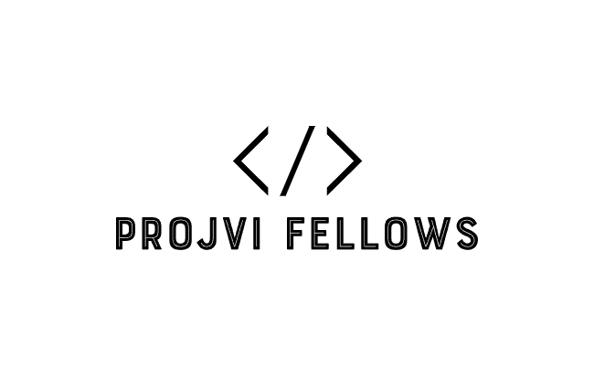

<br />
<div align="center">
  <a href="https://github.com/othneildrew/Best-README-Template">
    
  </a>
  <p align="center">
    <br />
    <a href="https://github.com/NolanMM/WebProject_Project_VI"><strong>Explore the docs »</strong></a>
    <br />
    <br />
    <a href="https://demowebprojectvi.azurewebsites.net/">View Demo</a>
    ·
    <a href="https://github.com/NolanMM/WebProject_Project_VI/issues">Report Bug</a>
    ·
    <a href="https://github.com/NolanMM/WebProject_Project_VI/issues">Request Feature</a>
  </p>
</div>

<details>
  <summary><b>Table of Contents</b></summary>
  <ol>
    <li>
      <a href="#about-the-project">About The Project</a>
      <ul>
        <li><a href="#built-with">Built With</a></li>
      </ul>
    </li>
    <li>
      <a href="#getting-started">Getting Started</a>
      <ul>
        <li><a href="#installation">Installation</a></li>
      </ul>
    </li>
    <li><a href="#roadmap">Roadmap</a></li>
    <li><a href="#license">License</a></li>
    <li><a href="#contact">Contact</a></li>
  </ol>
</details>

## About The Project

[![Product Name Screen Shot][product-screenshot]](https://example.com)

There are many great social network platform like facebook, twitter, instagram out there but we didn't find one that really suit our needs

Here's why:

* Our privacy matters: Existing social network platforms may not fully meet your privacy requirements. With our platform, you have control over your data and can store it securely on your own server.
* Tailored to our needs: We understand that one size does not fit all. Our platform allows you to customize your social network according to your specific requirements and preferences. If your Pc does not have enough memory to run the server, you can rent a server from a hosting provider such as Azure.
* We want to learn: We want to learn about how to build a social network platform
so we created this project to help us and other people to create their own social network platform that suit their needs.

Of course, no one template will serve all projects since your needs may be different. So We'll be adding more features in the near future. Thanks to all the people have contributed to expanding this project ! :smile:

</br>
<div align="center">

### Built With

[![C#][C#]][C#-url] [![MySQL][MySql]][MySql-url] [![Blazor][Blazor]][Blazor-url] [![GitHub][GitHub]][GitHub-url] [![MIT License][license-shield]][license-url] [![Contributors][contributors-shield]][contributors-url] [![Issues][issues-shield]][issues-url]

</div>

## Getting Started

This is an example of how you may give instructions on setting up your project locally.
To get a local copy up and running follow these simple example steps.

### Installation

_The Instruction for installing and set up the project locally._

1. Read the `Readme.md` in [WebProject_Project_VI](https://github.com/NolanMM/WebProject_Project_VI)
   </br>
2. Clone the Project Repository

   ```sh
   git clone https://github.com/NolanMM/WebProject_Project_VI.git
   ```

</br>

## Roadmap

* [ ] Continuous Design UI
* [ ] Image Upload Support
* [ ] Files Upload Support
* [ ] Category Post Support
* [ ] Language Support
  * [ ] Russian
  * [ ] Vietnamese
  * [ ] Hindi
  * [ ] Chinese
  * [ ] France
  
</br>

<!-- LICENSE -->
## License

Distributed under the MIT License. See `LICENSE.txt` for more information.

<p align="right">(<a href="#readme-top">back to top</a>)</p>

<!-- CONTACT -->
## Contact

NolanM - Minh Nguyen - [@Gmail](https://twitter.com/your_username) - <minhlenguyen02@gmail.com>

Project Link: [https://github.com/NolanMM/WebProject_Project_VI](https://github.com/NolanMM/WebProject_Project_VI)

<!-- MARKDOWN LINKS & IMAGES -->
[C#]: https://img.shields.io/badge/c%23-%23239120.svg?style=for-the-badge&logo=csharp&logoColor=white
[C#-url]: https://learn.microsoft.com/en-us/dotnet/core/whats-new/dotnet-8
[MySql]: https://img.shields.io/badge/mysql-%2300f.svg?style=for-the-badge&logo=mysql&logoColor=white
[MySql-url]: https://azure.microsoft.com/en-ca/products/mysql
[Blazor]: https://img.shields.io/badge/blazor-%235C2D91.svg?style=for-the-badge&logo=blazor&logoColor=white
[Blazor-url]: https://learn.microsoft.com/en-us/aspnet/core/release-notes/aspnetcore-8.0?view=aspnetcore-8.0#blazor
[GitHub]: https://img.shields.io/badge/github-%23121011.svg?style=for-the-badge&logo=github&logoColor=white
[GitHub-url]: https://github.com/
[contributors-shield]: https://img.shields.io/github/contributors/NolanMM/WebProject_Project_VI.svg?style=for-the-badge
[contributors-url]: https://github.com/NolanMM/WebProject_Project_VI/graphs/contributors
[license-shield]: https://img.shields.io/github/license/NolanMM/WebProject_Project_VI.svg?style=for-the-badge
[license-url]: https://github.com/NolanMM/WebProject_Project_VI/blob/master/LICENSE.txt
[issues-shield]: https://img.shields.io/github/issues/NolanMM/WebProject_Project_VI.svg?style=for-the-badge
[issues-url]: https://github.com/NolanMM/WebProject_Project_VI/issues
[product-screenshot]: images/Demo.png
